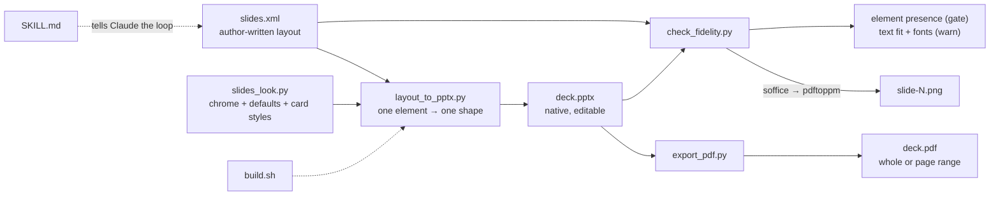
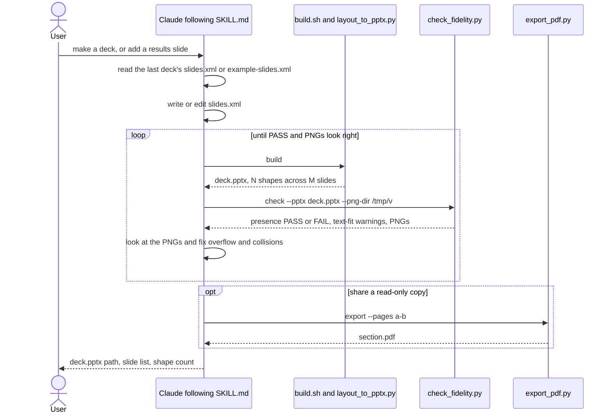

# Contributing

Everything hangs off one rule: **each declared XML element becomes exactly one
pptx shape**, and the author states all geometry. Adding an element means adding an
emitter to `_EMITTERS` in `layout_to_pptx.py`, its tag to `_SHAPE_TAGS` in
`check_fidelity.py`, its look knobs to `slides_look.py`, a row in `LAYOUT_FORMAT.md`,
and a gallery slide in `example-slides.xml` — then rebuild `example-slides.pptx` /
`.pdf` (both are committed) and run `uv run ruff check`, `uv run ty check`, and
`claude plugin validate . --strict`. Keep the renderer transparent: no layout engine,
no silent drops — malformed input is a `LayoutError`.

## How the pieces fit

## The authoring loop Claude runs

