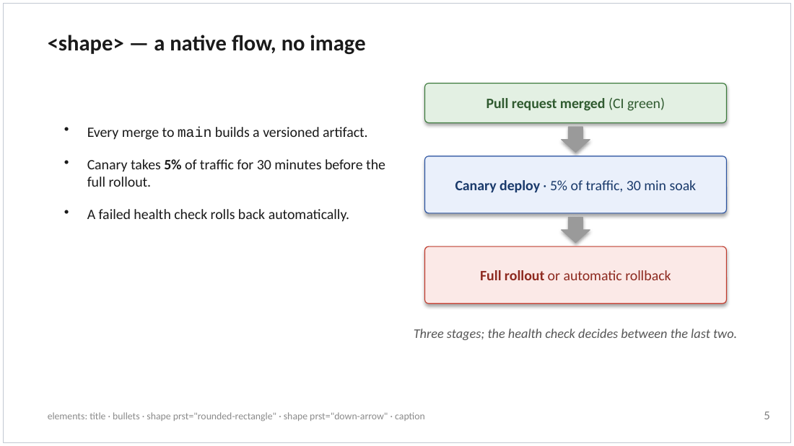
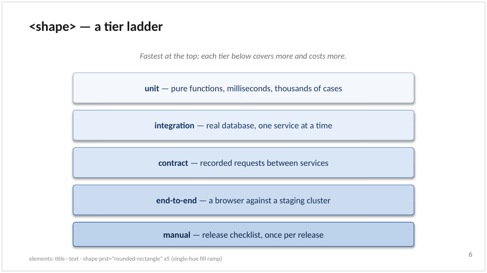
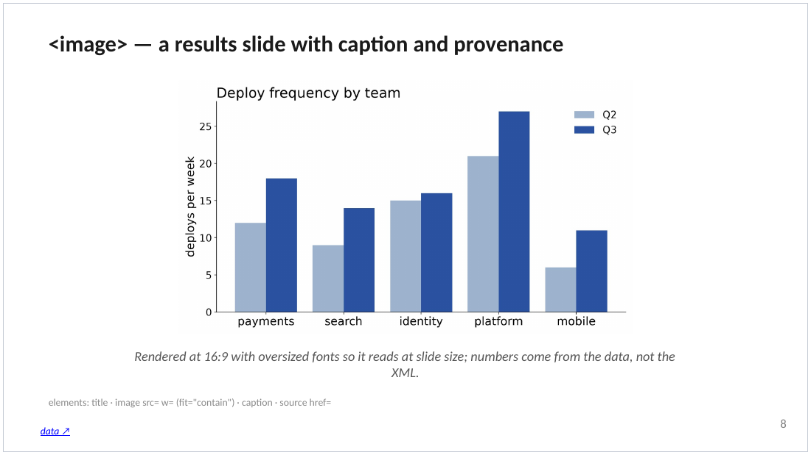
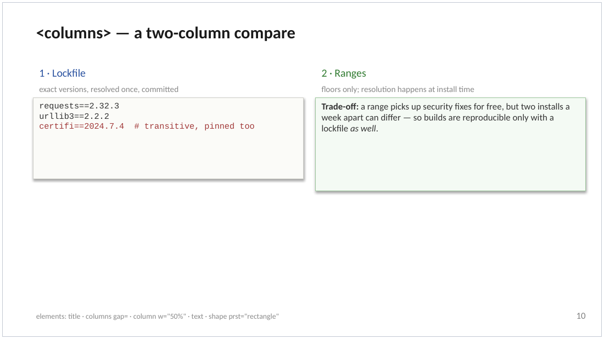
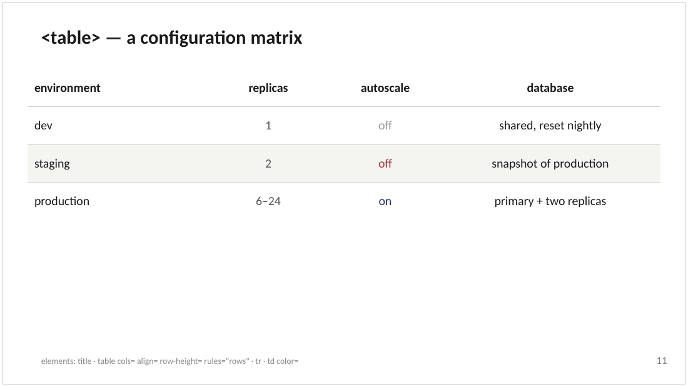
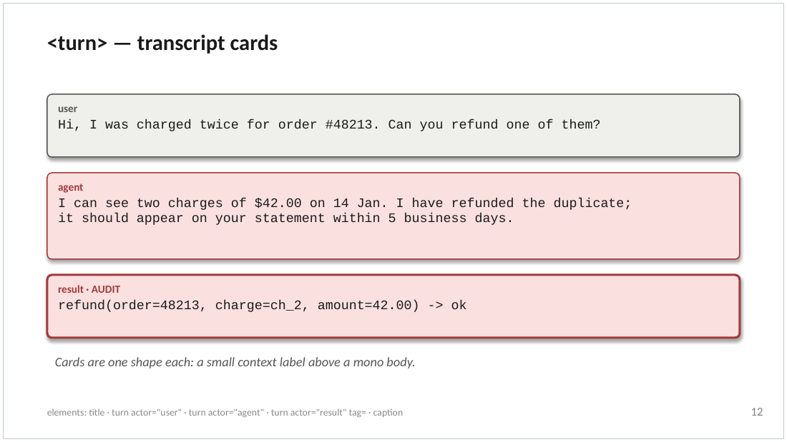

# Research Slides Skill

A [Claude Code](https://claude.com/claude-code) skill for building **native, editable
`.pptx` decks** from an XML layout file that the agent writes.

It was built to turn **AI research results into slides** — eval numbers, plots,
verbatim transcripts and prompts — for a weekly research check-in, where the deck has
to be regenerated from fresh data, stay editable by people afterwards, and never
silently drop a shape. You state every element — text, bullets, tables, transcript
cards, figures, with geometry in inches — in `slides.xml` (agent-generated, hand-editable); `layout_to_pptx.py` maps
each one onto exactly one [python-pptx](https://python-pptx.readthedocs.io/) shape, so
the result opens cleanly in Google Slides or PowerPoint; `check_fidelity.py` proves
nothing was dropped and renders per-slide PNGs to eyeball.

## What it makes

Six slides from the built gallery (LibreOffice renders of the `.pptx`; every shape is a
real, editable object in PowerPoint or Google Slides):

<table>
  <tr>
    <td></td>
    <td></td>
  </tr>
  <tr>
    <td align="center"><code>&lt;shape&gt;</code> flow — boxes + block arrows, no image</td>
    <td align="center"><code>&lt;shape&gt;</code> tier ladder</td>
  </tr>
  <tr>
    <td></td>
    <td></td>
  </tr>
  <tr>
    <td align="center"><code>&lt;image&gt;</code> results slide + <code>&lt;caption&gt;</code> + <code>&lt;source&gt;</code></td>
    <td align="center"><code>&lt;columns&gt;</code> compare</td>
  </tr>
  <tr>
    <td></td>
    <td></td>
  </tr>
  <tr>
    <td align="center"><code>&lt;table&gt;</code> — one editable table object</td>
    <td align="center"><code>&lt;turn&gt;</code> transcript cards</td>
  </tr>
</table>

## Gallery

[`example-slides.pptx`](example-slides.pptx) / [`example-slides.pdf`](example-slides.pdf)
is a built gallery, one slide per element or recurring pattern (`<text>` and inline
runs, `<bullets>`, `<shape>` flows and ladders, `<image>`, `<columns>`, `<table>`,
`<turn>` cards), each naming the elements it uses. Its source is
[`example-slides.xml`](example-slides.xml) — copy a `<slide>` from there to start.

To view a `.pptx` locally without PowerPoint, VS Code's
[Office Viewer](https://marketplace.visualstudio.com/items?itemName=cweijan.vscode-office)
extension renders it in the editor; or upload it to Google Drive and open with Google
Slides.

## Install

**Claude Code, as a plugin** — namespaced `/research-slides-skill:research-slides-skill`, updated
through the marketplace:

```
/plugin marketplace add alex-remedios/research-slides-skill
/plugin install research-slides-skill@alex-remedios
```

**Claude Code, from a skills directory** — the repo carries a `.claude-plugin/plugin.json`,
so a clone under a skills directory auto-loads as `research-slides-skill@skills-dir` on the next
session, no install step:

```bash
git clone https://github.com/alex-remedios/research-slides-skill ~/.claude/skills/research-slides-skill      # personal: every project
git submodule add https://github.com/alex-remedios/research-slides-skill .claude/skills/research-slides-skill  # one project, pinned
```

**Any agent that reads the [Agent Skills](https://agentskills.io) standard** (Claude Code,
Codex, Cursor, …):

```bash
npx skills add alex-remedios/research-slides-skill
```

**A team** can have Claude Code offer the install when the project is trusted, from
`.claude/settings.json`:

```json
{
  "extraKnownMarketplaces": {
    "alex-remedios": { "source": { "source": "github", "repo": "alex-remedios/research-slides-skill" } }
  },
  "enabledPlugins": { "research-slides-skill@alex-remedios": true }
}
```

Then ask Claude to "make a deck", or invoke the skill by name.

## Requirements

- [`uv`](https://docs.astral.sh/uv/) — the scripts declare their dependencies inline
  (`python-pptx`, `typer`, `pillow`), so `uv run` fetches them into a cached
  per-script environment. Without `uv`, `pip install python-pptx typer pillow` and
  `build.sh` falls back to `python3`.
- Optional, for the PNG check and PDF export: LibreOffice (`soffice`) and poppler
  (`pdftoppm`, `pdfseparate`, `pdfunite`). On Linux also install the Carlito font
  (`fonts-crosextra-carlito`), metric-compatible with Calibri, so the local render
  breaks lines where PowerPoint and Google Slides do; `check_fidelity.py` warns if
  it is missing.

## Dependency isolation — what happens inside someone else's project

The scripts run under [PEP 723 inline metadata](https://docs.astral.sh/uv/guides/scripts/),
so `uv run layout_to_pptx.py` ignores the enclosing project's `pyproject.toml`, lockfile
and virtualenv: a project pinned to `python-pptx==0.6` or Pydantic 1 is unaffected and
unaffecting. Things that *do* leak through, and what to do:

| Scenario | Behaviour | Fix |
| --- | --- | --- |
| Project has a `.python-version` older than 3.10 | `uv` picks a compatible interpreter anyway (downloading one if allowed) | none; set `UV_PYTHON=3.12` if downloads are blocked |
| Air-gapped machine, no `uv` downloads | first `uv run` cannot fetch wheels/Python | `uv python install 3.12` and warm the cache once online, or `pip install` the three deps and use `python3` |
| No `uv`, project venv on the `PATH` | `build.sh` uses that `python3`; old `python-pptx` (<1.0) fails on enum/`Length` changes | `pip install "python-pptx>=1.0.2" typer` into that venv |
| Windows | `build.sh` needs Git Bash or WSL; the Python scripts run natively | `uv run layout_to_pptx.py slides.xml` directly |
| No LibreOffice/poppler | `check_fidelity.py` skips the PNG step and says so; `export_pdf.py` exits with the missing tool named | install them, or skip the visual check |

Pin harder for reproducibility with `uv lock --script layout_to_pptx.py` (writes
`layout_to_pptx.py.lock` beside it) or an `exclude-newer` date under `[tool.uv]` in the
inline metadata.

## Quick start

```bash
bash build.sh example-slides.xml                                   # -> example-slides.pptx
uv run check_fidelity.py example-slides.xml --pptx example-slides.pptx --png-dir /tmp/v
uv run export_pdf.py example-slides.pptx                           # -> example-slides.pdf
uv run export_pdf.py example-slides.pptx --pages 3-5 --out section.pdf --max-mb 1
```

`build.sh <deck-dir>` renders `<deck-dir>/slides.xml` to `<deck-dir>/<deck-dir>.pptx`.
`export_pdf.py` writes one slide per page for the whole deck or a page range, and
rasterizes the PDF when it exceeds `--max-mb` (LibreOffice embeds fonts, so a vector
export can run to ~1 MB per page).

## Files

| File | Role |
| --- | --- |
| `SKILL.md` | The skill: how Claude authors, builds, checks, and exports a deck |
| `LAYOUT_FORMAT.md` | The `slides.xml` vocabulary the agent writes to — every element and attribute |
| `layout_to_pptx.py` | Renderer: XML layout → one python-pptx shape per element |
| `check_fidelity.py` | Gate: element-presence check + LibreOffice/poppler PNG render |
| `export_pdf.py` | PDF export: whole deck or page range, optional size cap |
| `slides_look.py` | The look: chrome, defaults, colours, card styles — one place to tweak |
| `build.sh` | Wrapper: deck dir or layout file → named `.pptx` |
| `example-slides.xml` · `.pptx` · `.pdf` | The gallery: source and built outputs |
| `figures/` | The gallery's chart, and `gallery/` renders used in this README |
| `.claude-plugin/` | Plugin + marketplace manifests, so the repo installs as a Claude Code plugin |

## Contributing

See [CONTRIBUTING.md](CONTRIBUTING.md) for the architecture diagrams and the rules for adding an element.

## Status

Extracted from a research project's weekly-deck toolchain; API may still move.

## License

[MIT](LICENSE).
